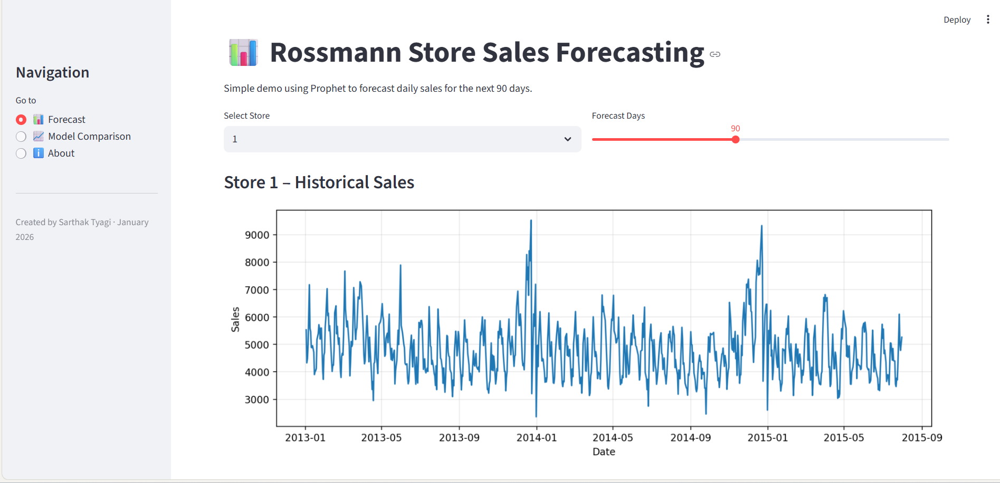
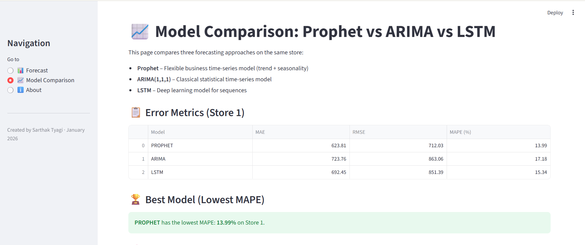
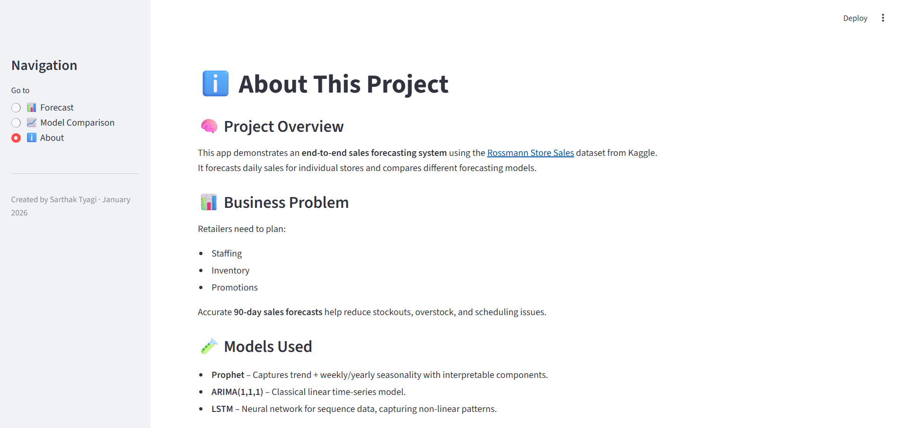

# 📊 Rossmann Store Sales Forecasting

End‑to‑end time‑series forecasting project using the Rossmann Store Sales dataset (Kaggle) to predict retail sales for individual stores and compare multiple forecasting models.

**GitHub:** https://github.com/sarthakshivaay/sales-forecasting-system  
**Live Demo:** https://sales-forecasting-system-48aguxznlnrn2ewhjkwove.streamlit.app/

---

## 📸 Demo Screenshots

### 🔮 Forecast – Store‑Level Predictions



*90‑day sales forecast for a selected store using Prophet with 95% confidence intervals.*

### 📈 Model Comparison – Error Metrics



*Side‑by‑side comparison of Prophet, ARIMA, and LSTM based on MAE, RMSE, and MAPE.*

### ℹ️ About – Project Overview



*In‑app documentation describing the problem, data source, models, and limitations.*

---

## 🎯 Project Overview

This project demonstrates a **production‑style sales forecasting pipeline** for a large retail chain:

- **Data:** Loads daily sales data for 1,115 Rossmann stores across Germany, Poland, and Hungary (2013–2015).
- **Pipeline:** Cleans, aggregates, and engineers time‑series features.
- **Models:** Trains and compares three forecasting approaches:
  - **Prophet** – Business time‑series with seasonality.
  - **ARIMA(1,1,1)** – Classical statistical model.
  - **LSTM** – Deep learning for sequence data.
- **Dashboard:** Interactive Streamlit app for store-level forecasts and model comparison.

### Business Context

Retailers need accurate **sales forecasts** to:
- Optimize staffing schedules
- Manage inventory levels
- Plan promotional campaigns
- Reduce stockouts and overstock situations

This project showcases how different forecasting approaches perform on real retail data.

---

## 📂 Data Source & Licensing

This project uses the **Rossmann Store Sales** dataset from Kaggle:

📍 **Competition Page:**  
https://www.kaggle.com/competitions/rossmann-store-sales

### ⚠️ Important – Data Not Included

- Raw CSV files are **NOT included** in this repository to respect Kaggle's data sharing policies.
- The code is publicly shared under MIT License (as permitted by Kaggle's terms for public code sharing).
- **You must download the data yourself** from the Kaggle competition page.

**How to obtain the data:**

1. Create a free Kaggle account.
2. Visit: https://www.kaggle.com/competitions/rossmann-store-sales/data
3. Download:
   - `train.csv` 
   - `test.csv` 
   - `store.csv` 
4. Place them in:
   ```
   data/raw/train.csv
   data/raw/test.csv
   data/raw/store.csv
   ```

See **[Setup & Installation](#setup--installation)** below for full instructions.

---

## 🏗️ Project Structure

```text
sales-forecasting-system/
├── data/
│   ├── raw/                           # Kaggle CSVs (download yourself)
│   │   ├── train.csv
│   │   ├── test.csv
│   │   └── store.csv
│   └── processed/
│       └── rossmann_prepared.csv      # Output from data pipeline
│
├── models/                            # Saved trained models
│   ├── prophet_store_1.pkl
│   ├── arima_store_1.pkl
│   ├── lstm_store_1.pkl
│   └── results_store_1.pkl
│
├── src/
│   ├── data_pipeline.py               # ETL + feature engineering
│   └── forecast_models.py             # Train Prophet, ARIMA, LSTM
│
├── screenshots/
│   ├── about_page.png
│   ├── forecast_page.png
│   └── model_comparison.png
│
├── streamlit_app.py                   # Streamlit dashboard (3 pages)
├── requirements.txt                   # Python dependencies
├── .gitignore                         # Excludes data, venv, models
└── README.md                          # This file
```

---

## ⚙️ Setup & Installation

### Prerequisites

- **Python 3.8+**
- **git**
- Kaggle account (free) to download data

### 1. Clone Repository

```bash
git clone https://github.com/sarthakshivaay/sales-forecasting-system.git
cd sales-forecasting-system
```

### 2. Create Virtual Environment

**Windows (PowerShell):**
```bash
python -m venv venv
venv\Scripts\Activate.ps1
```

**macOS/Linux (Bash):**
```bash
python -m venv venv
source venv/bin/activate
```

### 3. Install Dependencies

```bash
pip install --upgrade pip
pip install -r requirements.txt
```

**Dependencies include:**
- pandas, numpy, scikit-learn
- Prophet, statsmodels (ARIMA)
- TensorFlow, Keras (LSTM)
- Streamlit

### 4. Download Kaggle Data

**Option A: Manual Download (Recommended)**

1. Go to: https://www.kaggle.com/competitions/rossmann-store-sales/data
2. Download the three CSV files.
3. Extract and place in:
   ```
   data/raw/train.csv
   data/raw/test.csv
   data/raw/store.csv
   ```

**Option B: Using Kaggle CLI**

```bash
# Install kaggle CLI
pip install kaggle

# Download dataset
kaggle competitions download -c rossmann-store-sales -p data/raw/

# Extract
cd data/raw && unzip rossmann-store-sales.zip && cd ../..
```

### Verify Data

Check that files are in place:
```bash
ls data/raw/

# Should show:
# train.csv
# test.csv
# store.csv
```

---

## 🧮 Data Pipeline

Run the ETL pipeline to create a modeling‑ready dataset:

```bash
python src/data_pipeline.py
```

**What this script does:**

1. Loads `train.csv` and `store.csv`
2. Merges them on `Store` ID
3. Cleans data:
   - Removes days when stores were closed
   - Handles missing values in competition distance, promotions
4. Engineers time‑based features:
   - Year, Month, Week, DayOfWeek, Quarter, DayOfMonth
5. Creates lag and rolling features:
   - `Sales_lag_7`: Sales from 7 days prior
   - `Sales_lag_30`: Sales from 30 days prior
   - `Sales_rolling_7`: 7‑day moving average
6. Outputs to:
   ```
   data/processed/rossmann_prepared.csv
   ```

**Expected Output:**
```
============================================================
ROSSMANN DATA PIPELINE
============================================================
[1/5] Loading data...
✓ Loaded 1,017,209 records from 1115 stores
[2/5] Cleaning data...
✓ Cleaned data: 844,392 records
[3/5] Engineering features...
✓ Created 18 features
[4/5] Selecting features...
✓ Selected 12 features
[5/5] Saving processed data...
✓ Saved to data/processed/rossmann_prepared.csv
✓ Data shape: (844,392, 12)
✓ Date range: 2013-01-01 to 2015-07-31
============================================================
✅ PIPELINE COMPLETE!
============================================================
```

---

## 🤖 Train Forecasting Models

Train Prophet, ARIMA, and LSTM, then save results:

```bash
python src/forecast_models.py
```

**What this script does:**

1. Loads processed data (`data/processed/rossmann_prepared.csv`)
2. Focuses on **Store 1** for comparison
3. Trains three models:
   - **Prophet** – Trend + weekly/yearly seasonality
   - **ARIMA(1,1,1)** – Classical statistical model
   - **LSTM** – Deep learning (50 units, 2 layers, 20 epochs)
4. Evaluates each on a hold‑out test period using:
   - **MAE** – Mean Absolute Error
   - **RMSE** – Root Mean Squared Error
   - **MAPE** – Mean Absolute Percentage Error
5. Saves to `models/`:
   - `prophet_store_1.pkl`
   - `arima_store_1.pkl`
   - `lstm_store_1.pkl`
   - `results_store_1.pkl` (metrics for dashboard)

**Expected Console Output:**
```
============================================================
MODEL 1: PROPHET (Time-Series Forecasting)
============================================================
[PROPHET] Using 781 records from Store 1
[PROPHET] Training model...
[PROPHET] ✓ Model trained
[PROPHET] MAE:  623.81
[PROPHET] RMSE: 712.03
[PROPHET] MAPE: 13.99%

============================================================
MODEL 2: ARIMA (Classical Time-Series)
============================================================
[ARIMA] Using 781 records from Store 1
[ARIMA] Training model with order (1,1,1)...
[ARIMA] ✓ Model trained
[ARIMA] MAE:  723.76
[ARIMA] RMSE: 863.06
[ARIMA] MAPE: 17.18%

============================================================
MODEL 3: LSTM (Deep Learning)
============================================================
[LSTM] Using 781 records from Store 1
[LSTM] Created 751 sequences (lookback=30)
[LSTM] Building model...
[LSTM] Training model (20 epochs)...
[LSTM] ✓ Model trained
[LSTM] MAE:  692.45
[LSTM] RMSE: 851.39
[LSTM] MAPE: 15.34%

============================================================
MODEL COMPARISON SUMMARY
============================================================
Model           MAE          RMSE         MAPE
------------------------------------------------------------
PROPHET         623.81       712.03       13.99%
ARIMA           723.76       863.06       17.18%
LSTM            692.45       851.39       15.34%
------------------------------------------------------------
✅ Best Model: PROPHET (lowest MAPE)
============================================================

✅ ALL MODELS TRAINED AND SAVED!
```

---

## 🖥️ Run Streamlit Dashboard

Launch the interactive app:

```bash
streamlit run streamlit_app.py
```

Opens at: `http://localhost:8501`

### Dashboard Pages

#### 📊 **Forecast**
- **Store Selector:** Choose any store (1–1,115).
- **Forecast Slider:** Set forecast horizon (30–180 days).
- **Historical Chart:** Daily sales from Jan 2013 to Jul 2015.
- **Forecast Chart:** 90‑day forecast with 95% confidence interval.
- **KPIs:**
  - Historical avg daily sales
  - Forecast avg daily sales
  - Expected percentage change

#### 📈 **Model Comparison**
- **Metrics Table:** MAE, RMSE, MAPE for Prophet, ARIMA, LSTM.
- **Best Model Badge:** Highlights the model with lowest MAPE.
- **Explanations:** Describes what each metric means.

#### ℹ️ **About**
- **Business Problem:** Why retailers need sales forecasts.
- **Models:** Overview of Prophet, ARIMA, LSTM.
- **Data Source:** Link to Kaggle competition.
- **Tech Stack:** Libraries and tools used.
- **Limitations:** Current project constraints.
- **Future Work:** Potential improvements.

---

## 🏆 Model Performance

Results on Store 1 (holdout test period):

| Model  | MAE    | RMSE   | MAPE   | Interpretation |
|--------|--------|--------|--------|---|
| Prophet | 623.81 | 712.03 | 13.99% | **Best** – Captures trend and seasonality well |
| LSTM   | 692.45 | 851.39 | 15.34% | Good – Can learn complex patterns |
| ARIMA  | 723.76 | 863.06 | 17.18% | Baseline – Linear model limitations |

**Winner: Prophet** – Most accurate on this store with lowest MAPE.

### Metric Definitions

- **MAE (Mean Absolute Error):** Average absolute difference between predicted and actual sales (in € units).
- **RMSE (Root Mean Squared Error):** Penalizes large errors more heavily; in same units as MAE.
- **MAPE (Mean Absolute Percentage Error):** Percentage error; easier to compare across scales.

---

## 🛠️ Tech Stack

| Component | Technology |
|-----------|-----------|
| **Language** | Python 3.12 |
| **Data** | pandas, numpy |
| **Time-Series** | Prophet, statsmodels (ARIMA) |
| **Deep Learning** | TensorFlow, Keras (LSTM) |
| **Visualization** | matplotlib, seaborn |
| **Web App** | Streamlit |
| **Version Control** | Git, GitHub |

---

## 📋 Key Features

✅ **End-to-End Pipeline**
- Data cleaning, feature engineering, model training

✅ **Three Forecasting Models**
- Prophet (interpretable), ARIMA (classical), LSTM (deep learning)

✅ **Interactive Dashboard**
- Store selection, forecast horizon, model comparison

✅ **Kaggle-Compliant**
- Code shared publicly; data download managed by users

✅ **Production-Ready Code**
- Organized structure, error handling, logging

---

## ⚠️ Limitations & Known Issues

- **Single-Store Comparison:** Models trained only on Store 1 for consistency.
- **No Hyperparameter Tuning:** Using baseline configurations.
- **Limited Data Period:** Historical data from 2013–2015 only.
- **No Auto-Retraining:** Manual model training required.
- **LSTM Baseline:** Simple architecture without extensive experimentation.

---

## 🚀 Future Enhancements

- [ ] Multi-store model selection and ensemble forecasting
- [ ] Automated hyperparameter tuning (Optuna, Hyperopt)
- [ ] Store-level model selection logic
- [ ] Anomaly detection for data quality
- [ ] REST API for external model serving
- [ ] Docker containerization for production deployment
- [ ] Scheduled retraining pipeline (Airflow, GitHub Actions)
- [ ] Advanced architectures (Transformers, N-BEATS)
- [ ] Uncertainty quantification (Bayesian methods)

---

## 🤝 Contributing

Contributions are welcome! Feel free to:
- Open issues for bugs or questions
- Submit pull requests for improvements
- Suggest additional models or features

---

## 📜 License

This project code is shared under the **MIT License** (automatically via Kaggle's terms for public code sharing).

**Data Usage:**
- Rossmann dataset remains under Kaggle's competition rules.
- See: https://www.kaggle.com/competitions/rossmann-store-sales/rules

---

## 👤 Author

**Sarthak Tyagi**
- LinkedIn: https://www.linkedin.com/in/sarthakshivaay
- GitHub: https://github.com/sarthakshivaay
- Email: sarthaktyagi@outlook.com

---

## 🙏 Acknowledgments

- **Kaggle:** For hosting the Rossmann Store Sales competition and dataset.
- **Facebook (Meta):** For developing Prophet.
- **Statsmodels Community:** For ARIMA implementation.
- **TensorFlow/Keras:** For deep learning tools.

---

## 📞 Questions?

Feel free to reach out or open an issue on GitHub.

Happy forecasting! 📊
